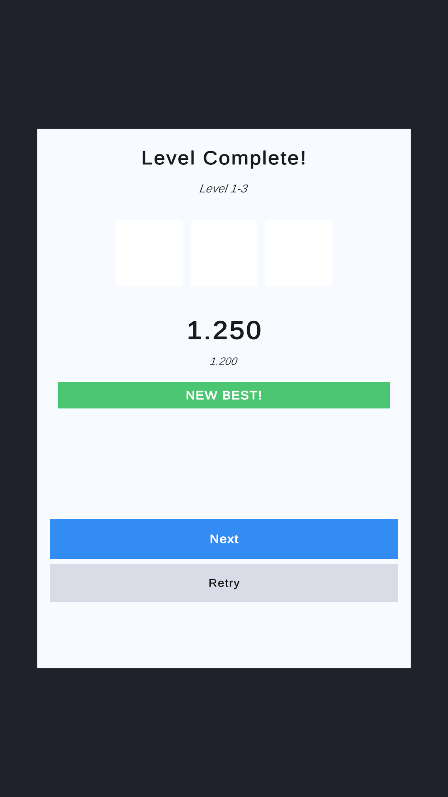

# KitforgeLabs · UI Kit

> Mobile UGUI kit for hybrid-casual games. **Click. Play. Ship.**



`com.kitforgelabs.mobile-ui-kit` ships a **ready-to-play demo scene** that wires the 17-element catalog, three themes and demo services for every game-side contract. Open it, press Play, see everything live — then drop the `KitforgeRoot.prefab` into your own scene and reuse the snippets.

---

## What's in the box

- **`UIManager`** — stack-based screen flow (`Push` / `Pop` / `Replace` / `PopToRoot`) with prefab cache.
- **`PopupManager`** — priority queue (`Meta < Gameplay < Modal`), eviction with state preservation, backdrop sync, depth cap.
- **`ToastManager`** — non-blocking, auto-dismiss, severity-tinted toasts.
- **`UIThemeConfig`** — one `ScriptableObject` that re-skins every screen, popup, HUD and toast. Three presets ship in (`Theme_Default`, `Theme_Casual`, `Theme_Premium`).
- **17-element catalog** — 10 popups (Confirm · Pause · Tutorial · Reward · Shop · NotEnoughCurrency · DailyLogin · LevelComplete · GameOver · Settings) · 1 toast (Notification) · 2 screens (Loading · MainMenu) · 4 HUDs (Coins · Gems · Energy · Timer). All prefabs pre-wired.
- **Demo Scene** — `KitforgeDemoScene.unity` with `DemoServicesBootstrap` providing in-memory economy, progression, shop, ads, time and localization data. Press Play and explore.
- **KitforgeLabs Hub** (`KitforgeLabs → UI Kit → Hub`) — Setup wizard, Catalog browser with copy-paste snippets, Theme Studio, Test launcher, inline Cheatsheet.

---

## Quickstart (2 steps)

1. **Install the package.** Add to `Packages/manifest.json`:
   ```json
   "com.kitforgelabs.mobile-ui-kit": "https://github.com/BKGcode/mobile-ui-kit.git#v1.3.4"
   ```
   Or via Package Manager → **Add package from git URL…**

2. **Open the demo scene.** Top menu: **`KitforgeLabs → UI Kit → Open Demo Scene`**. Press Play. HUDs show live values, the main menu wires every popup, the side panel quick-spawns the rest, and a top-right button cycles themes.

That's it. Drag `KitforgeRoot.prefab` into your own scene when you want to start your game, swap `DemoServicesBootstrap` for your real service implementations.

### Prerequisites

| Dependency | Required by | How to install |
|---|---|---|
| Unity 6000.1 LTS or newer | Runtime | Editor |
| TextMeshPro | Runtime (the asmdef references it) | Package Manager (built-in) |
| DOTween Pro | Recommended for screen/popup show & hide animations | [Asset Store](https://assetstore.unity.com/packages/tools/visual-scripting/dotween-pro-32416) |
| VContainer (or any DI) | **Opt-in only.** Runtime asmdef has zero DI dependency. Wire your container resolution into `UIServices` setters at boot. | [OpenUPM](https://openupm.com/packages/jp.hadashikick.vcontainer/) |

---

## Catalog

| # | Element | Pattern | Service required |
|---|---|---|---|
| 1 | ConfirmPopup | `PopupManager.Show<T>` | — |
| 2 | PausePopup | `PopupManager.Show<T>` | — (owns `Time.timeScale` while visible) |
| 3 | TutorialPopup | `PopupManager.Show<T>` | — |
| 4 | RewardPopup | `PopupManager.Show<T>` | `IEconomyService` (claim) |
| 5 | ShopPopup | `PopupManager.Show<T>` | `IShopDataProvider`, `IEconomyService` |
| 6 | NotEnoughCurrencyPopup | `PopupManager.Show<T>` | `IEconomyService`, `IAdsService` |
| 7 | DailyLoginPopup | `PopupManager.Show<T>` | `IProgressionService`, `IPlayerDataService` |
| 8 | LevelCompletePopup | `PopupManager.Show<T>` | `IProgressionService` |
| 9 | GameOverPopup | `PopupManager.Show<T>` | `IEconomyService`, `IAdsService` |
| 10 | SettingsPopup | `PopupManager.Show<T>` | `IPlayerDataService`, `IUILocalizationService` |
| 11 | NotificationToast | `ToastManager.Show<T>` | — |
| 12 | LoadingScreen | `UIManager.Push<T>` | — |
| 13 | MainMenuScreen | `UIManager.Push<T>` | — |
| 14 | HUDCoins | drag-and-drop prefab | `IEconomyService` |
| 15 | HUDGems | drag-and-drop prefab | `IEconomyService` |
| 16 | HUDEnergy | drag-and-drop prefab | `IEconomyService`, `IProgressionService`, `ITimeService` |
| 17 | HUDTimer | drag-and-drop prefab | `ITimeService` (UTC modes only) |

All catalog popups, screens and toasts ship pre-wired in `KitforgeRoot.prefab`. The Hub Catalog tab generates the canonical `using` + `[SerializeField]` + `Show<T>(...)` snippet for every element — search by name, copy, paste.

---

## Spawn pattern (auto-generated by the Hub Catalog tab)

```csharp
// 1. Add these usings at the top of your script:
using KitforgeLabs.UIKit.Core;
using KitforgeLabs.UIKit.Catalog.Confirm;

// 2. Wire the manager once via Inspector or DI:
[SerializeField] private PopupManager _popupManager;

// 3. Spawn:
_popupManager.Show<ConfirmPopup>(new ConfirmPopupData
{
    Title = "Quit?",
    Message = "Progress will be lost.",
    ConfirmLabel = "Yes",
    CancelLabel = "Stay"
});
```

---

## Theme

Three presets ship in `Runtime/Theme/Presets/`. Swap at design time by assigning any `UIThemeConfig.asset` to `KitforgeRoot/KitforgeThemeBinder._theme`. Swap at runtime via `_themeBinder.SetTheme(myTheme)` — re-distributes to the three managers and re-initializes cached instances.

Create your own theme: **Assets → Create → KitforgeLabs → UI Kit → Theme** (or duplicate a preset). Tune 16 colors, sprite slots, 1 font, audio cues, default animation preset and safe-area config in the Inspector.

---

## Services

Service binding (economy, ads, time, progression, player data, localization, audio, shop) is buyer-implemented through 8 interfaces in `Runtime/Services/`. The runtime asmdef has zero DI dependency.

Three implementation tiers ship in:

| Tier | Folder | When to use |
|---|---|---|
| **Demo** | `Runtime/Services/Demo/` | Want to see the kit working immediately with sensible mock data. Used by the Demo Scene. |
| **Null** | `Runtime/Services/Null/` | Production scene without your services wired yet — kit boots, HUDs show `--`, popups still work. |
| **Your impl** | your project | Wire your live services into `KitforgeRoot/UIServices` Inspector slots. |

`UIServices` auto-instantiates Null defaults when a slot is empty, so the kit always boots and you can swap in implementations at your pace.

---

## Architecture decisions

| # | Decision | Rationale |
|---|---|---|
| 1 | Runtime asmdef has zero DI dependency | Buyers without VContainer must boot in one step. Service binding lives in `UIServices` MonoBehaviour (Inspector setters); DI users wire their container resolution there at boot. |
| 2 | `UIManager` is a `MonoBehaviour`, not a singleton | One scene = one manager via Inspector references. |
| 3 | Screens registered as a flat `UIModuleBase[]` registry, resolved by `Type` | Inspector authoring trivial. One prefab per concrete `UIModule` subclass. |
| 4 | Popup priority is an `enum` (Meta / Gameplay / Modal) | Three buckets cover every hybrid-casual case. |
| 5 | `PopupRecord` stores `Data` so eviction can re-enqueue with state | A modal evicting a Gameplay popup must restore it with its original payload. |
| 6 | VContainer is opt-in, never a Runtime reference | Avoids forcing a DI container on buyers who use Zenject, no DI, or their own injector. |
| 7 | A single `UIThemeConfig` asset feeds all three managers | "Skin it once" is the kit's pitch. `KitforgeThemeBinder` auto-wires this. |
| 8 | Demo services live in the package (not as samples) | The Demo Scene must work out-of-box without buyer downloads. Demo services live in `Runtime/Services/Demo/` and stay opt-in via `DemoServicesBootstrap` MonoBehaviour. |

---

## Non-goals

1. **No data binding framework.** Modules expose `Bind(TData)` and you call it.
2. **No localization layer.** Bring your own (Unity Localization / I2 / custom JSON). Modules accept already-resolved strings.
3. **No networking, save backend or analytics.** Service interfaces are contracts — your game implements them.
4. **No DI container in Runtime.** `KitforgeLabs.UIKit` has zero reference to VContainer / Zenject / etc.
5. **No animation engine.** DOTween Pro is the assumed sequencer for show/hide motion.
6. **No visual screen-graph editor.** Inspector + prefab references only — the Hub authors *scene state*, not screen graphs.
7. **No UI Toolkit runtime support.** UGUI only.

---

## License

Proprietary — KitforgeLabs. See `LICENSE.md` (TBD before public release).

---

## Changelog

See [`CHANGELOG.md`](./CHANGELOG.md). Versioning follows [SemVer](https://semver.org/).
